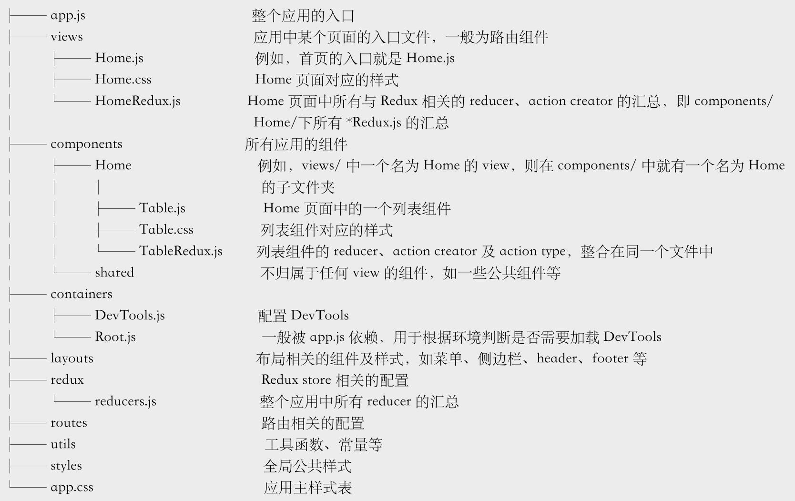

# 概述

本例是学习《深入React技术栈》的简单博客demo，主要目的是学习和深入理解redux的使用，由于使用的是和书中的不同版本的router所以，需要简单了解一下react-router 4.0

## 目录结构

views文件夹下放着的是所有路由入口页
components下放着的是每个入口页需要的组件、样式及Redux相关的文件

容器组件和展示组件区别主是看是否感知redux，或者说，是否使用connect方法让组件redux的状态树中获取数据

views/HomeRedux.js包含了Home页面所有组件相关的reducer及actionCreator